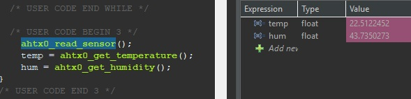

# AHT10_STM32_Library
A library for integrating the AHT10 temperature and humidity sensor with STM32 microcontrollers.

# How to use?
## 1. Include the header file in your main program

```
#include "aht10.h"
```

## 2. Initialize the AHT10 sensor

```
ahtx0_begin(&hi2c1);
```
If calibration is enabled, define the AHTX0_CALIBRATION_ENABLED macro. By default, it is already defined in aht10.h.

## 3. Read temperature and humidity data
It triggers the measurement and waits until the data is ready.
```
ahtx0_read_sensor();
temp = ahtx0_get_temperature();
hum = ahtx0_get_humidity();
```
# Example
The example for STM32L051 can be found in repository.





